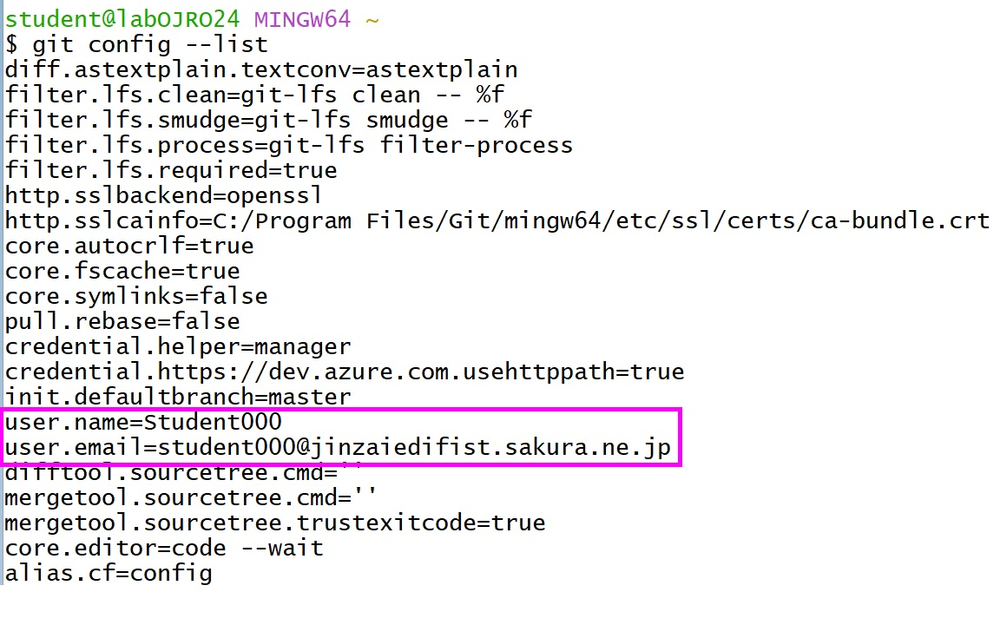

## Git の初期設定
Git では、コミットで使用するユーザー名とEmailアドレスを最初に設定する必要があります。これには、`git config` コマンドを使用します。
次の手順を実行します。
1. `git  config –-global user.name Student000`
2. `git  config –-global user.email student000@jinzaiedifist.sakura.ne.jp`

このコマンドでは、`--global`オプションを指定しているので、コンピューターのすべてのユーザーに適用される構成です。
設定後、`git config --list` で設定を確認すると、次のように幼児されます。
